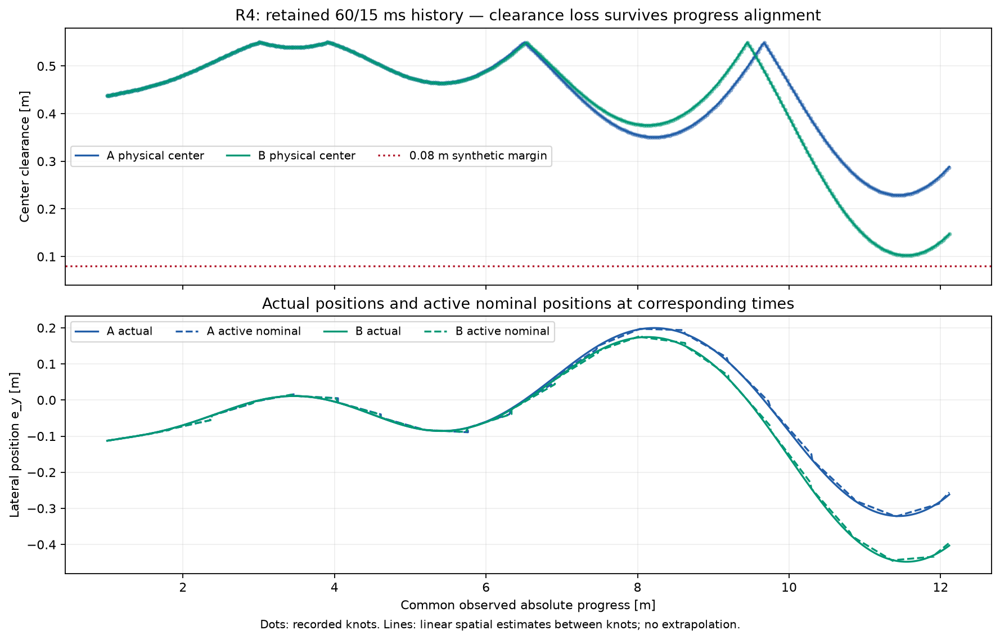
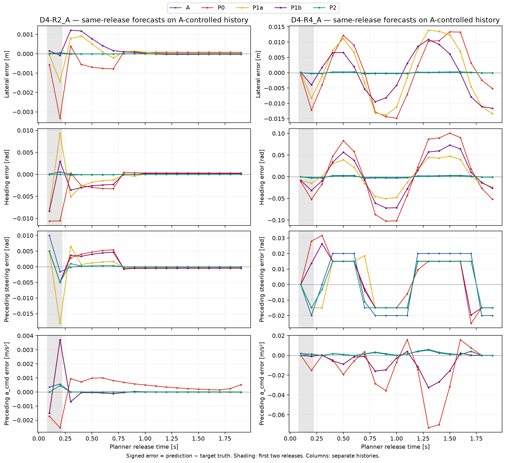
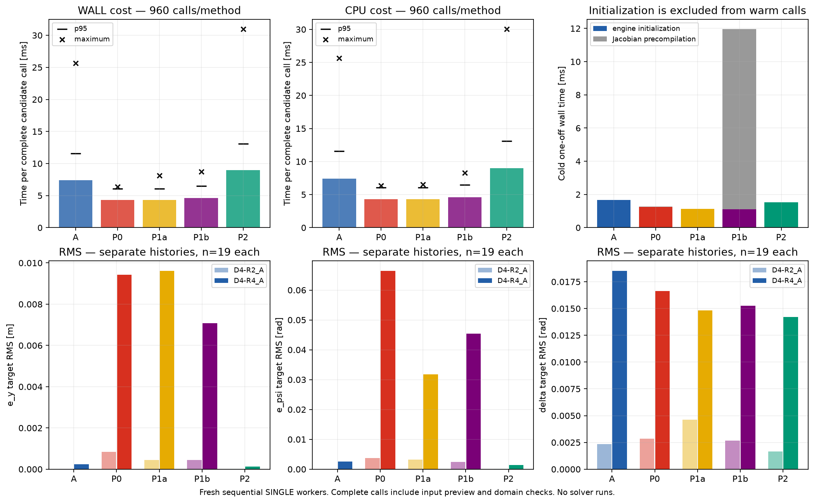

# Task007D-P — lightweight handoff-state prediction study

## Protocol fixed before measurements

Primary-approved offline study only, starting at main
b1ab2205b1de0ff7a425de7adf68f7a1a376fbc3. Keep every src/ module and prior evidence unchanged.
No new physical simulation, NMPC/solver run, Architecture C or production integration.
Use 152 D4 release contexts (four timing regimes, both host histories) and 38 retained gamma2
D3 contexts as a separate reference. Score at each original estimated target, using retained
D3/D4 target truth. Reject changed source, fixture or raw evidence via existing SHA-256.

P0 samples the active nominal packet; P1a adds wrapped actual-minus-nominal release error.
P1b evolves only `[e_y,e_psi,vy,r]` with `(A_h-B_h K)e` using existing TVLQR RK4(h,2)
Jacobians and stored gains at each ideal driver-grid interval. Keep speed and progress errors
constant, explicitly without dynamic coupling. Partial final intervals use the same existing
Jacobian construction at their own duration (rounded to 1e-12 s to remove timestamp roundoff).
P1b is the ideal, unsaturated four-state design approximation: no affine correction for
nominal interpolation defect, known held-input forcing, delay/saturation dynamics or six-state
consistency claim. The state approximation is deliberately separate from feasible input preview.
A and P2 call the existing nonlinear predictors unchanged; require exact reproduction of saved
state/control outputs on every reference context or stop for review.

All lightweight preceding-input previews start from applied input and replay release-known
pending work with the existing application steering clamp. Busy ticks are skipped. Later ideal
zero-latency feedback uses the existing tracker with the candidate's own state estimate, stored
nominal input/gain, request box/rate clamp and elapsed-application clamp. Apply already-due work
at target, then return before new target-tick feedback. These are input estimates, never known
future commands. Include this preview and output validity checks in measured candidate costs.
No future history enters a candidate. Missing/out-of-horizon/domain failures have null residuals.

Score wrapped state errors and steering/acceleration errors separately. Detect intervening
accepted packet/fallback/disturbance events; exclude contaminated continuations. Acceptance
exactly at target does not alter the preceding physical state. Preceding-control truth excludes
new feedback computed at target, including zero-latency work applied later in that timestamp.
Report each host/regime separately, all/first/later/after-second phases, 1e-12 SI win/loss ties;
p95 only with at least 20 contexts. Audit node versus interior targets explicitly.

Benchmark five fresh sequential Accelerate SINGLE workers, one per method, after focused tests.
Select D4 releases 1, 2, 10, 18 from every regime and both hosts (32 contexts). Three warm-up
sweeps; 30 measured repetitions per context (960 calls/method), with rotating order. Report
per-call wall/CPU median/p95/max, cold engine initialization and required Jacobian-function
precompilation separately. No per-context A/B matrix caching: evaluations remain in warm cost.
Thread-mode verification, observed process threads and batch CPU/wall ratio accompany timings.
Historical preparation times are descriptive context, not concurrent controlled solver timing.
Check measurement guards and >=1 GiB free; never overlap tests, plotting or other experiments.

Produce three figures only after measurement exits: common-progress D5 clearance/position;
per-release heading/lateral and preceding steering errors; absolute cost alongside accuracy.
Keep raw outputs under results/task007d/p and compact tables/PNG under docs/task007d/p.


## Results and recommendation

**Task007D-P complete; stop for review.** All five methods were evaluated on 190 immutable
release contexts (152 D4 primary, 38 D3 gamma2 reference), producing 950 forecasts. All targets
were comparable: zero forecast/domain failures, missing truth, intervening authority changes
or predicted center-boundary crossings. Existing A/P2 reproduce all **380/380** retained
state-and-control outputs exactly. No new plant simulation or optimizer solve was performed.

The lightweight methods save approximately **2.8–3.1 ms versus A and 4.4–4.7 ms versus P2**
per median complete call in this benchmark. They do **not** retain comparable state accuracy.
P1a helps some channels relative to nominal-only P0; P1b adds calculation without consistent
benefit and has particularly poor high-latency yaw-rate errors. None merits immediate
closed-loop integration from this evidence. A remains default, B remains experimental.
This study neither selects a predictor for Architecture C nor authorizes its implementation.

## Dataset, information boundary and scoring

The source is the frozen N8/gamma2, dt=0.1 s, H=0.8 s synthetic Task007C candidate:
Q=diag(4,4,1,200,200), R=diag(25,1), W=diag(1,0.1), lambda_s=0,
alpha_vy=alpha_r=1. No weights, tires, model, TVLQR, solver, warm-start, delay estimator,
reference generation or physical scheduling changed. The retained input files and frozen
source hashes are checked by `dataset()` before analysis. Timing regimes are:

| History | Imposed planner / codriver | Hosts | Contexts per host |
|---|---:|---|---:|
| D4-R1 | 35 / 0 ms | A, B separately | 19 |
| D4-R2 | 35 / 5 ms | A, B separately | 19 |
| D4-R3 | 60 / 5 ms | A, B separately | 19 |
| D4-R4 | 60 / 15 ms | A, B separately | 19 |
| D3-ref, supplementary | 35 / 15 ms | A, B separately | 19 |

Each forecast sees only the measured release state, immutable active packet, applied input,
last actual application time, release-known pending request/application time, estimated delay,
parameters, tracker settings and actuator limits. The packet is pinned at release; neither
actual solver readiness nor future truth/commands are forecast inputs. The candidate interface
accepts one `PredictionRelease`; the scoring module alone receives future history. A deliberately
ignores the prefix through its existing API; this is the retained legacy baseline, not an
information advantage conferred by the offline comparison. Private trackers and buffers avoid
mutation of the release context. Only P1b compiled Jacobian functions are cached.

For every method, state residual is predicted minus retained actual state at the **same estimated
target**, with heading residual wrapped into the established angle convention. Input residual
is predicted minus applied input at that target's pre-handoff phase (defined below). Each of
six SI state channels and both control channels is reported separately. Acceleration command
is the dynamic-model `a_cmd=Fx/m`, not an assertion that it equals `dvx/dt`.

Scoring reuses D3/D4 target truth: **18 exact recorded event states and one off-event RK4
reconstruction per history** (180 event samples, 10 reconstructions). The latter is a
non-mutating partial step from the preceding recorded state under its held command, using
existing model/substep/curvature conventions. It is an estimate, not an independently sampled
physical event or exact dense RK4 output. No physical event or integration partition was
inserted. See [D3 methodology](TASK007D_AB_PILOT.md) for reconstruction validation/limitations.
A readiness-state mismatch at a different timestamp is not included in these residuals.

Accepted packet changes, fallback and approved disturbances strictly between release and
target contaminate the old-policy continuation and would exclude it. Acceptance at target
changes subsequent authority, not preceding continuous state. There are no excluded cases here.
Failures would retain their reason and null residuals, never zero error. Optional coverage audit
finds 60 ms uncontaminated coverage only for R3/R4 (76 releases, largely the existing primary
targets); every 80 ms target has intervening authority. No additional forecasts or fictitious
fixed-handoff history were generated.

## Nominal interpolation audit

`TrajectoryPacket.sample()` interpolates **all six states linearly in time** between optimized
100 ms nodes. Packet construction unwraps heading along the trajectory; sampled heading can
therefore lie outside the canonical wrapped range. Lightweight candidates wrap their resulting
heading, and scoring wraps heading differences for every method. A/P2 arithmetic is untouched.
At an exact node the state matches that node, to numerical representation. The accepted packet
may have a shorter initial trimmed interval.

Nominal steering/acceleration and stored feedback gains are zero-order held, with the next
interval selected at its node; terminal sampling retains the final available input. Stored
curvature is also held. Linear interpolation of progress and lateral/heading states does not
integrate the Frenet dynamics through varying curvature. In particular, it is neither a dense
nonlinear trajectory solution nor an exact nominal flow for the linearized error recurrence.
No method extrapolates outside packet coverage.

Every history contains **17 node targets and two interior targets**: releases 1 and 2. The first
release is near 0.100 s, estimated delay 17 ms, target 0.117 s; release 2 targets 0.235 s for
35 ms histories or 0.260 s for 60 ms histories. Subsequent estimates are the imposed planner
delay. Thus primary D4 has 136 node/16 interior targets, supplementary D3 has 34/4. This is
real interior coverage but a narrow transient sample, not a broad test of arbitrary future
fixed targets. The recurrence still samples interior nominal states at intervening driver ticks.

## Candidate definitions and P1b mathematical boundary

Let n(t) be the release-active packet sample, and e0=x_release−n(t_release), wrapping its
heading component. P0 returns n(target); P1a returns n(target)+e0 with wrapped heading.
P1a holds speed/progress errors as well as the four lateral errors constant. These are explicit
approximations, not additional vehicle models. Domain checks reject nonfinite/noncanonical
states, speed outside the established domain, invalid Frenet denominator, reversed target
progress, out-of-box controls, nonpositive axle loads and invalid longitudinal grip.
Center clearance is separately reported, rather than confused with model-domain validity.

P1b uses canonical indices **L=[5,3,1,2]**, corresponding to **[e_y,e_psi,vy,r]**. Existing
TVLQR steering correction is −K e_L, with K a length-four row. For each interval h:

```text
F_h = existing SymbolicBicycle.rk4(h, 2)
Jx, Ju = existing TVLQR(..., dt=h).jacobian(n(t), u_nom(t), kappa_nom(t))
A_h = Jx[L,L]          # 4 x 4 block of the existing 6 x 6 Jacobian
B_h = Ju[L, steering]  # 4 x 1 block of the existing 6 x 2 Jacobian
e_L(next) = (A_h - B_h K(t)) e_L(current)
e_vx(next) = e_vx(current)
e_s(next)  = e_s(current)
x_hat(target) = n(target) + e(target)
```

Intervals follow the global 10 ms driver grid; a partial interval uses its actual h and the
same RK4/Jacobian construction. K is the stored held 10 ms gain, not a newly designed
partial-step gain. Heading error is wrapped after each update and after nominal addition.
The benchmark requires Jacobian functions for h=10, 7 and 5 ms; h is rounded to 1e-12 s solely
to remove grid timestamp noise. Gains are sampled anew each interval, including changes.
No Riccati solve or invented longitudinal coupling is added.

This is dimensionally consistent with the **ideal unsaturated four-state TVLQR design**.
It is **not a validated six-state closed-loop predictor**. It omits nominal interpolation's
affine defect, held/pending-input forcing, delay/saturation dynamics, and speed/progress
coupling into lateral errors. Holding the other errors is the explicitly declared P1a policy.
The separate feasible input preview does not make that recurrence a dynamically consistent
state/input rollout. These limitations plausibly contribute to poor results, but the experiment
does not isolate their causal shares. No semantic defect in retained A/P2 was found or repaired.

## Preceding-input contract

For P0/P1a/P1b, initialize with the currently applied command and last application timestamp.
Replay the immutable pending **requested** command only when its scheduled time is reached.
Apply the existing steering clamp using time elapsed since the preceding actual application.
Skip driver ticks while that command is pending. At later ticks, evaluate the existing tracker
on the candidate's state estimate, current nominal input and stored gain; then apply its existing
request limits and elapsed physical application clamp. P0 has zero tracking correction in this
preview, but its applied steering can still differ from nominal because of prior commitments
and rate limits. P1a/P1b retain existing speed feedback on their estimated speed error.

Unknown future latency remains the documented ideal zero-latency assumption. Already-due
commands at the target are applied before returning; new feedback computed at the target is
excluded because handoff precedes that computation. This includes the special zero-duration,
due-at-release case. The scorer similarly excludes later same-timestamp zero-latency commands
rather than blindly using the final state-log row's input. Future recorded commands appear
only in scoring, never in candidate code.

All returned controls are causally estimated, box/load/grip checked and steering-rate feasible;
all costs below include this work. However, **an admissible input estimate and a nominal-based
state estimate need not satisfy the nonlinear flow jointly**. They are not ready-made drop-in
NMPC initialization guarantees. In particular, P1b's ideal recurrence is separate from its
constrained input preview. Input accuracy alone cannot rescue poor state accuracy.

## Matched accuracy

[accuracy.csv](task007d/p/accuracy.csv) contains signed mean, RMS, maximum absolute error,
per-release better/worse/tie counts against both A and P2, failures and exclusions for every
channel, history and phase (`all`, `first`, `later`, `after_second`).
[release_errors.csv](task007d/p/release_errors.csv) includes all predictions, signed residuals,
target times, node/interior flags and predicted center clearance. Comparisons use a 1e-12
SI absolute tie threshold to exclude arithmetic noise. P95 is intentionally blank: each
history has at most 19 samples, below the declared minimum of 20. No pooling of A/B hosts
is used to manufacture sample count or conceal an individual-state regression.

The following RMS state table retains all six channels; each row has 19 comparable targets.
A/B in the history name is the controller that generated the physical record, distinct from
the forecast method column. Units: vx/vy m/s, r rad/s, e_psi rad, s_abs/e_y m.

| History | Method | vx | vy | r | e_psi | s_abs | e_y |
|---|---|---:|---:|---:|---:|---:|---:|
| D4-R1_A | A | 0.000186465 | 0.000353384 | 0.0135859 | 0.000239197 | 3.27091e-06 | 2.22701e-05 |
| D4-R1_A | P0 | 0.000599821 | 0.00700082 | 0.0463263 | 0.00326797 | 0.000156716 | 0.000702561 |
| D4-R1_A | P1a | 0.000884786 | 0.0138808 | 0.0228106 | 0.0028445 | 0.000500105 | 0.000383509 |
| D4-R1_A | P1b | 0.000884786 | 0.00857931 | 0.0210097 | 0.00242647 | 0.000500105 | 0.000438886 |
| D4-R1_A | P2 | 2.60653e-07 | 8.97041e-06 | 0.000308829 | 3.8632e-05 | 1.18822e-06 | 3.70726e-06 |
| D4-R1_B | A | 0.00019072 | 0.00035319 | 0.0157647 | 0.00028716 | 3.4612e-06 | 2.678e-05 |
| D4-R1_B | P0 | 0.000702052 | 0.00707628 | 0.0466081 | 0.00333096 | 0.000178592 | 0.00074004 |
| D4-R1_B | P1a | 0.000877225 | 0.0137794 | 0.0218728 | 0.0028152 | 0.000501294 | 0.000405279 |
| D4-R1_B | P1b | 0.000877225 | 0.00827545 | 0.020674 | 0.00237562 | 0.000501294 | 0.000448433 |
| D4-R1_B | P2 | 2.6146e-07 | 8.97077e-06 | 0.000308812 | 3.86321e-05 | 1.18442e-06 | 3.70716e-06 |
| D4-R2_A | A | 0.0001617 | 0.000202659 | 0.00838995 | 0.000133645 | 3.79091e-06 | 1.2392e-05 |
| D4-R2_A | P0 | 0.000944266 | 0.00885611 | 0.0692517 | 0.0037176 | 0.000198899 | 0.000845693 |
| D4-R2_A | P1a | 0.00109845 | 0.0143032 | 0.0544402 | 0.00316159 | 0.00051158 | 0.000453171 |
| D4-R2_A | P1b | 0.00109845 | 0.00830493 | 0.0284362 | 0.00249656 | 0.00051158 | 0.000442803 |
| D4-R2_A | P2 | 0.000104822 | 6.87393e-05 | 0.00166967 | 5.729e-05 | 2.35669e-06 | 5.40592e-06 |
| D4-R2_B | A | 0.000165818 | 0.000185764 | 0.00972676 | 0.000152023 | 3.93503e-06 | 1.40089e-05 |
| D4-R2_B | P0 | 0.000989746 | 0.00888647 | 0.070832 | 0.00375362 | 0.000207001 | 0.00086923 |
| D4-R2_B | P1a | 0.00110032 | 0.0142728 | 0.055232 | 0.00316475 | 0.000510789 | 0.000450104 |
| D4-R2_B | P1b | 0.00110032 | 0.00834749 | 0.0290941 | 0.00250856 | 0.000510789 | 0.000439933 |
| D4-R2_B | P2 | 0.000104433 | 6.4357e-05 | 0.0016302 | 5.50015e-05 | 2.35453e-06 | 5.1957e-06 |
| D4-R3_A | A | 0.000190163 | 0.000720665 | 0.00871925 | 0.000315112 | 8.62664e-06 | 3.34788e-05 |
| D4-R3_A | P0 | 0.000729149 | 0.00773883 | 0.0728213 | 0.00295736 | 0.00030059 | 0.00102554 |
| D4-R3_A | P1a | 0.00143247 | 0.0216124 | 0.0610412 | 0.00456263 | 0.000539027 | 0.000596327 |
| D4-R3_A | P1b | 0.00143247 | 0.00880689 | 0.0381616 | 0.0028118 | 0.000539027 | 0.000368359 |
| D4-R3_A | P2 | 0.000105641 | 0.00016442 | 0.000941901 | 7.23196e-05 | 5.44049e-06 | 1.20752e-05 |
| D4-R3_B | A | 0.00020295 | 0.000806008 | 0.0109927 | 0.000382595 | 9.24996e-06 | 4.01419e-05 |
| D4-R3_B | P0 | 0.000761913 | 0.00773198 | 0.0743175 | 0.00298405 | 0.000311961 | 0.00106163 |
| D4-R3_B | P1a | 0.00143928 | 0.0214712 | 0.0616859 | 0.00455331 | 0.000538316 | 0.000593181 |
| D4-R3_B | P1b | 0.00143928 | 0.00875225 | 0.0388541 | 0.00282127 | 0.000538316 | 0.000359399 |
| D4-R3_B | P2 | 0.000105287 | 0.000155135 | 0.000919414 | 6.81811e-05 | 5.43342e-06 | 1.15771e-05 |
| D4-R4_A | A | 0.00137954 | 0.00217149 | 0.125324 | 0.00259894 | 4.81536e-05 | 0.000244685 |
| D4-R4_A | P0 | 0.038437 | 0.196478 | 0.885436 | 0.0664767 | 0.00200192 | 0.0094173 |
| D4-R4_A | P1a | 0.0205716 | 0.0931477 | 0.455219 | 0.0318299 | 0.00156772 | 0.00962125 |
| D4-R4_A | P1b | 0.0205716 | 0.137496 | 1.26042 | 0.0454189 | 0.00156772 | 0.00708412 |
| D4-R4_A | P2 | 0.000836281 | 0.000470134 | 0.0865519 | 0.00142307 | 2.71916e-05 | 0.000128905 |
| D4-R4_B | A | 0.00140935 | 0.00208402 | 0.123793 | 0.00255526 | 5.13916e-05 | 0.000239328 |
| D4-R4_B | P0 | 0.0371568 | 0.18702 | 0.866556 | 0.063496 | 0.00195127 | 0.00878202 |
| D4-R4_B | P1a | 0.019872 | 0.0888928 | 0.456982 | 0.0305362 | 0.00170125 | 0.009309 |
| D4-R4_B | P1b | 0.019872 | 0.130147 | 1.22523 | 0.0434571 | 0.00170125 | 0.0070223 |
| D4-R4_B | P2 | 0.0008609 | 0.000458035 | 0.0872391 | 0.00143044 | 2.91983e-05 | 0.000129155 |

The supplemental D3 35/15 ms histories lead to the same caution: on D3-ref_A, P1b yaw-rate
RMS is 1.30511 rad/s, versus 0.0478599 for A, 0.254134 for P1a and 0.0253375 for P2.
Full supplemental channel results remain separately named in the CSV.

Preceding-input RMS is reported separately below. These two channels are the actual NMPC
previous-input requirement, not just nominal controls. Units are radians and m/s² (`Fx/m`).

| History | Method | Steering RMS | a_cmd RMS |
|---|---|---:|---:|
| D4-R1_A | A | 0.00269387 | 0.000173096 |
| D4-R1_A | P0 | 0.00230051 | 0.000491298 |
| D4-R1_A | P1a | 0.00320444 | 0.000758008 |
| D4-R1_A | P1b | 0.00192512 | 0.000758008 |
| D4-R1_A | P2 | 7.29768e-05 | 1.74914e-07 |
| D4-R1_B | A | 0.00291142 | 0.000175955 |
| D4-R1_B | P0 | 0.00227675 | 0.000629139 |
| D4-R1_B | P1a | 0.00371976 | 0.000750364 |
| D4-R1_B | P1b | 0.00191539 | 0.000750364 |
| D4-R1_B | P2 | 7.29776e-05 | 1.75338e-07 |
| D4-R2_A | A | 0.0023273 | 0.000153173 |
| D4-R2_A | P0 | 0.00286618 | 0.000900022 |
| D4-R2_A | P1a | 0.00461237 | 0.000934053 |
| D4-R2_A | P1b | 0.0026576 | 0.000934053 |
| D4-R2_A | P2 | 0.00164454 | 0.000103352 |
| D4-R2_B | A | 0.00230058 | 0.000155829 |
| D4-R2_B | P0 | 0.00287322 | 0.000955813 |
| D4-R2_B | P1a | 0.00461773 | 0.00093483 |
| D4-R2_B | P1b | 0.00265016 | 0.00093483 |
| D4-R2_B | P2 | 0.00164078 | 0.000102951 |
| D4-R3_A | A | 0.00233447 | 0.000178492 |
| D4-R3_A | P0 | 0.0027765 | 0.000674136 |
| D4-R3_A | P1a | 0.00897668 | 0.00124318 |
| D4-R3_A | P1b | 0.002736 | 0.00124318 |
| D4-R3_A | P2 | 0.00163233 | 0.000105415 |
| D4-R3_B | A | 0.00230381 | 0.000187841 |
| D4-R3_B | P0 | 0.00278429 | 0.00072432 |
| D4-R3_B | P1a | 0.00901928 | 0.00124803 |
| D4-R3_B | P1b | 0.00273174 | 0.00124803 |
| D4-R3_B | P2 | 0.00163119 | 0.000105044 |
| D4-R4_A | A | 0.0185295 | 0.00217973 |
| D4-R4_A | P0 | 0.0166405 | 0.0279105 |
| D4-R4_A | P1a | 0.0148124 | 0.0120582 |
| D4-R4_A | P1b | 0.015265 | 0.0120582 |
| D4-R4_A | P2 | 0.014208 | 0.00238206 |
| D4-R4_B | A | 0.0183999 | 0.00242112 |
| D4-R4_B | P0 | 0.0156246 | 0.0282865 |
| D4-R4_B | P1a | 0.0148236 | 0.0124906 |
| D4-R4_B | P1b | 0.0143375 | 0.0124906 |
| D4-R4_B | P2 | 0.0142768 | 0.00264559 |

P1a often improves nominal-only heading/lateral error, but not uniformly: R4 lateral RMS
worsens versus P0 on both hosts, and R3 heading RMS also worsens. P1b's R4_A lateral RMS
is lower than P0/P1a, yet yaw-rate RMS rises to **1.26042 rad/s** versus A's 0.125324 and
P2's 0.0865519. On R4_B it reaches 1.22523 rad/s with maximum error 1.89838 rad/s.
Those individual-state regressions preclude a favorable interpretation based only on lateral
position or a scalar aggregate.

Per-release comparisons reinforce this: R4_B P0 and P1b lateral errors are worse than A
on all 19 releases; P1a is better on one and worse on 18. P1b's steering estimate, however,
is better than A on 17, worse on one and tied on one. That improvement is not evidence of
joint state/input consistency. All per-state counts and signed biases are retained in the CSV.

### First release, estimator transition and later releases

The table shows lateral error magnitude/RMS in metres on A-controlled histories. First is
one absolute residual; later is releases 2–19; after_second is releases 3–19. The full CSV
provides this decomposition for every state/input and both hosts. Release 2 is also interior
and often strongly influences full-history RMS; removing release 1 alone does not isolate
steady estimator behavior. No phase was removed from the primary results.

| History | Method | First (n=1) | Later (n=18) | After second (n=17) |
|---|---|---:|---:|---:|
| D4-R1_A | A | 2.59091e-05 | 2.20503e-05 | 2.9789e-06 |
| D4-R1_A | P0 | 0.000531724 | 0.000710849 | 0.000398502 |
| D4-R1_A | P1a | 4.05301e-05 | 0.000393902 | 0.000287352 |
| D4-R1_A | P1b | 0.00016903 | 0.000449149 | 0.000461341 |
| D4-R1_A | P2 | 1.08521e-06 | 3.80025e-06 | 3.68778e-06 |
| D4-R2_A | A | 8.10813e-06 | 1.25873e-05 | 3.8792e-06 |
| D4-R2_A | P0 | 0.000559967 | 0.000858784 | 0.000358646 |
| D4-R2_A | P1a | 6.12346e-05 | 0.000465365 | 0.00032889 |
| D4-R2_A | P1b | 0.000151174 | 0.000453539 | 0.000466262 |
| D4-R2_A | P2 | 3.08949e-06 | 5.50611e-06 | 5.66562e-06 |
| D4-R3_A | A | 8.10813e-06 | 3.4343e-05 | 1.12757e-05 |
| D4-R3_A | P0 | 0.000559967 | 0.00104534 | 0.000371017 |
| D4-R3_A | P1a | 6.12346e-05 | 0.000612498 | 0.000306037 |
| D4-R3_A | P1b | 0.000151174 | 0.000376771 | 0.000387527 |
| D4-R3_A | P2 | 3.08949e-06 | 1.23847e-05 | 1.26754e-05 |
| D4-R4_A | A | 5.275e-06 | 0.000251387 | 0.000247362 |
| D4-R4_A | P0 | 0.000611297 | 0.00967429 | 0.00950504 |
| D4-R4_A | P1a | 9.35292e-05 | 0.00988487 | 0.0099686 |
| D4-R4_A | P1b | 0.000132518 | 0.00727817 | 0.00742711 |
| D4-R4_A | P2 | 1.08476e-06 | 0.000132437 | 0.000129002 |

The lightweight methods remain much worse than A/P2 after the first two releases. For example,
R2_A later-node lateral RMS is 0.000359/0.000329/0.000466 m for P0/P1a/P1b versus
0.000003879 m for A. These low-demand differences are small in absolute track units, but
are not comparable prediction accuracy. R4 errors grow to centimetre scale. The earlier D5
finding that P2 slightly worsens later low-latency heading/lateral errors is preserved, not
hidden by the much larger lightweight errors.

## Absolute computational cost

The benchmark ran once, sequentially, in five fresh Accelerate SINGLE processes. Each used
32 contexts: releases 1, 2, 10 and 18 from each primary regime/host. Three complete warm-up
sweeps (96 calls) preceded 30 rotating-order repetitions of every context (**960 measured calls
per method**, 4,800 total). No tests, analysis or plotting overlapped measurement. Process
thread observations were `[1]` for every worker, BLAS SINGLE was verified through its API,
and batch CPU/wall ratios were 0.99885–0.99969. Environment values alone were not the evidence.

Each measured call returns both state and preceding input, including snapshot adaptation into
private predictor objects, tracker requests, steering clamps and validity checks. No import,
JSON loading, solver optimization or gain-design solve is in the warm-call interval. A/P2 use
unchanged predictor arithmetic, but the offline wrapper's additional domain checks and private
tracker/buffer creation are included. This differs from the narrower historical prediction log.
Numbers are descriptive on this Mac, not hard-real-time bounds or Raspberry Pi estimates.

| Method | Wall median ms | Wall p95 ms | Wall max ms | CPU median ms | CPU p95 ms | CPU max ms |
|---|---:|---:|---:|---:|---:|---:|
| A | 7.394 | 11.570 | 25.672 | 7.393 | 11.567 | 25.622 |
| P0 | 4.319 | 6.060 | 6.377 | 4.318 | 6.058 | 6.373 |
| P1a | 4.303 | 6.056 | 8.143 | 4.303 | 6.055 | 6.525 |
| P1b | 4.607 | 6.502 | 8.704 | 4.606 | 6.501 | 8.285 |
| P2 | 8.986 | 13.098 | 30.953 | 8.984 | 13.092 | 30.030 |

| Method | Engine init wall / CPU ms | Function precompile wall / CPU ms |
|---|---:|---:|
| A | 1.656 / 1.653 | 0.002 / 0.002 |
| P0 | 1.257 / 1.256 | 0.003 / 0.003 |
| P1a | 1.137 / 1.138 | 0.004 / 0.005 |
| P1b | 1.118 / 1.119 | 10.838 / 8.548 |
| P2 | 1.525 / 1.525 | 0.002 / 0.003 |

P1b's 10.838 ms wall precompilation constructs the existing symbolic Jacobian functions for
three interval lengths. It does **not** store context A/B matrices: evaluating the full Jacobians,
extracting their lateral blocks and multiplying by held gains occurs inside every measured
forecast. A new unseen interval length incurs compilation on that call. The other precompute
values are essentially no-op overhead. Initialization times exclude module imports. Quantiles,
per-history timing and CPU costs are in [benchmark_summary.csv](task007d/p/benchmark_summary.csv).

These are complete unoptimized research candidates, so P0 is not a microsecond array lookup:
it still estimates a feasible preceding input and checks domains. P1b adds about 0.30 ms to
P1a's median warm call, plus cold compilation, without consistent accuracy benefit. Tiny P0/P1a
timing differences are not evidence of a meaningful ordering; fixed method order and one
measurement session leave drift/host-load uncertainty.

Historical retained preparation timing provides context only; no fresh solver campaign was run:

| History | Total preparation median ms | Prediction median ms | Median per-plan prediction share % | IPOPT median ms | Gain median ms |
|---|---:|---:|---:|---:|---:|
| D4-R1_A | 60.807 | 5.624 | 9.034 | 42.128 | 6.160 |
| D4-R1_B | 63.148 | 7.490 | 11.422 | 42.279 | 6.250 |
| D4-R2_A | 62.112 | 5.809 | 9.209 | 42.425 | 6.157 |
| D4-R2_B | 63.909 | 7.465 | 11.583 | 42.639 | 6.336 |
| D4-R3_A | 64.794 | 9.706 | 14.564 | 42.316 | 6.176 |
| D4-R3_B | 67.077 | 11.500 | 16.449 | 42.650 | 6.230 |
| D4-R4_A | 63.189 | 9.800 | 15.238 | 40.326 | 6.123 |
| D4-R4_B | 65.082 | 11.150 | 17.045 | 40.578 | 6.201 |
| D3-ref_A | 59.361 | 5.694 | 9.461 | 40.413 | 6.129 |
| D3-ref_B | 60.558 | 7.218 | 11.716 | 40.145 | 6.121 |

Saving 2.8–4.7 ms is measurable and potentially useful, but **modest in complete preparation**:
it is roughly 4–8% of the historical 61–67 ms primary totals as a scale comparison only.
It is not a measured end-to-end speedup; workloads, instrumentation and observation times differ.
Historically prediction accounts for roughly 9–17%, while optimization is about 40–43 ms and
gain calculation about 6 ms. Removing nonlinear prediction cannot remove those dominant costs.
The equal-weight benchmark overrepresents early transitions relative to a long run and does not
establish deadline tails. No accuracy sacrifice is justified by these timing numbers alone.

## Figures and physical relevance

### Figure 1 — retained clearance and nominal excursion



Both histories are restricted to common observed progress. Dots denote recorded knots; joining
lines are linear spatial estimates with no extrapolation. Dashed lower-panel curves are active
nominal lateral positions sampled at the corresponding physical times, then aligned in progress.
They are not a single global planned trajectory. The unchanged 0.08 m synthetic tracking margin
is explicit. D5's A/B minimum center clearances remain **0.228661 / 0.102185 m**, leaving B
0.022185 m beyond that margin. Matching progress does not remove the rightward nominal excursion;
tight tracking of that excursion does not imply adequate clearance. No new physical outcome is
claimed by plotting these retained records.

### Figure 2 — per-release errors



R2_A (35/5 ms) contrasts low latency with R4_A (60/15 ms); four rows separate lateral, heading,
steering and a_cmd errors. The first two releases are shaded, not dropped. Lightweight errors
persist later, and R4 shows much larger state errors despite occasionally improved steering
estimates. Axes carry signed SI residuals. Other hosts/channels remain in the numerical tables.

### Figure 3 — cost alongside accuracy



Bars show wall/CPU medians; dashes show p95 and crosses maximum. Cold initialization/function
compilation is a separate panel. Bottom panels compare R2_A and R4_A RMS without pooling or a
dual-axis speedup scale. The lower costs accompany substantially worse state accuracy.

Special attention to the R4_B low-clearance region: at release 18's target (1.860 s), actual
center clearance is about 0.106511 m. A/P2 predict 0.106404/0.106455 m; P0/P1a/P1b predict
0.104192/0.095908/0.095676 m. P1a/P1b lateral errors are −0.010604/−0.010836 m. At release
19's target (1.960 s), their lateral errors remain −0.013249/−0.011551 m, versus −0.0000867/
−0.0000463 m for A/P2. This is centimetre-scale error near a region whose retained physical
margin is only centimetres. Conservative sign at these two points is not a general safety
property; other residuals have other signs. All forecasts passed domain checks, but that does
not establish nonlinear consistency, body clearance, closed-loop robustness or physical validity.

## Decision gate answers

1. **Q1 — P0 pilot? No on current evidence.** Nominal interpolation is cheaper, but even node
   targets substantially miss physical state. Interior targets provide only two transient
   examples per history, too narrow to validate future fixed-time targets.
2. **Q2 — P1a advantage? Partial, not sufficient.** It often reduces P0 heading/lateral error
   and costs essentially the same, but worsens some channels/regimes and remains much less
   accurate than A/P2. It is the simplest candidate to retain for a separately authorized
   offline refinement discussion, not an approved runtime candidate.
3. **Q3 — P1b worth its calculations? No.** The exact TVLQR four-state block is used correctly
   under its declared ideal assumptions, but neither six-state consistency nor acceptable
   high-latency yaw accuracy follows. Its extra matrix work is not justified by these results.
4. **Q4 — meaningful absolute savings? Yes, modest.** Median savings are 2.8–3.1 ms versus A
   and 4.4–4.7 ms versus P2, not a removal of the dominant optimizer/gain cost. Historical
   total-preparation comparisons are descriptive, not a controlled end-to-end speedup.
5. **Q5 — valid preceding input while faster? Yes as a causal, actuator-feasible estimate.**
   All three remain faster after committed replay, future ideal feedback and domain checks.
   No as a guarantee of an exact future command or jointly consistent nonlinear state/input
   pair. This unresolved consistency/accuracy boundary blocks drop-in use.
6. **Q6 — candidate alongside C? None of P0/P1a/P1b for immediate closed-loop testing.**
   Retain the existing A and experimental B references. Any next work needs Engineering
   Orchestrator authorization; a bounded offline study of nominal-flow defect and input/state
   consistency with predefined channel tolerances would be more informative than a racing run.
   This is a recommendation only, not approval to refine equations or implement Architecture C.

## Verification, preservation and limitations

89 focused tests passed in 3.01 s: 27 new candidate/accounting/figure cases and 62 retained
committed-prefix/tracker cases. Tests cover node/interior sampling, angle continuity, canonical
and lateral ordering, P1a correction, exact P1b Jacobian/gain dimensions, partial and varying-gain
intervals, pending timing/busy behavior/steering limits, target ordering, no future-history
interface, missing/invalid horizons, nonmutation, repeatability and failure accounting. Three
figures regenerate byte-identically twice in the same environment; numerical report exports
also reproduce byte-for-byte. Figures were visually reviewed at full image scale. New arithmetic
assertions use 1e-12 absolute tolerance with zero relative tolerance for short deterministic
interpolation/matrix operations; existing tests and tolerances are unchanged.

Scoped Ruff lint and format checks cover the new scripts/tests. No `src/` or existing research
implementation changes are part of this task. The before/after preservation audit covers 431
preexisting tracked files (only the authorized handoff update differs), 10,912 unchanged prior
result files by size/mtime, and all 61 D3/D4 result files by SHA-256. The sole metadata exception
is ignored `results/.DS_Store`: its timestamp changed during the task (size stayed 8,196 bytes).
It was not edited by the study code, restored or staged; no experiment-evidence change was found. Raw D-P timings/forecasts remain
ignored under `results/task007d/p/study`; only compact tables and three PNGs are committed.
No historical unsuccessful cases were deleted or replaced. No architectural adoption occurred,
so no new ADR or roadmap change is appropriate.

Limitations: synthetic parameters/Planning fixture; short correlated histories; perfect captured
state; linearized ideal error policy; sparse interior target coverage; partial RK4 truth estimates;
unknown future feedback latency; no same-context closed-loop counterfactual; no body/continuous
boundary guarantee; no independent timing sessions or target hardware performance. Numeric
model-domain success is not physical validation. No scientific accuracy threshold was supplied;
the negative recommendation follows large observed individual-channel regressions, not an
invented universal tolerance. A/P2's exact retained reproduction verifies default arithmetic,
not their physical accuracy or the absence of every latent defect.

## Evidence and reproduction

The compact bundle is [docs/task007d/p](task007d/p/): `accuracy.csv`, `release_errors.csv`,
`benchmark_summary.csv`, `historical_preparation.csv`, `figure1_data.csv`, `summary.json`,
`inventory.json`, `verification.json` and exactly three figures. `summary.json` records measurement source hashes,
retained input hashes, selected contexts, backend/thread observations and raw-output hashes.
Its protocol-document hash is intentionally the pre-measurement protocol above, before results
were appended. Candidate/evaluation/benchmark/launcher code is unchanged since measurement.
`inventory.json` separately records final reporting/plot source and generated artifact hashes.
`verification.json` records final checks, preservation counts and the D5 source-table hash.

From the repository root, with the retained ignored D3/D4/D5 evidence and configured `.venv`:

```sh
# Fresh destination only. Predictor calls and benchmarks; no plant/optimizer campaign.
.venv/bin/python scripts/run_task007dp.py --output results/task007d/p/reproduction

# No forecasts or benchmarks: regenerate compact evidence and three figures after workers exit.
VECLIB_MAXIMUM_THREADS=1 XDG_CACHE_HOME=/private/tmp/apex-cache MPLCONFIGDIR=/private/tmp/apex-matplotlib .venv/bin/python scripts/report_task007dp.py --input results/task007d/p/study --output /private/tmp/apex-p-report-reproduction

# Figure-only reproduction is also covered by the focused test below; it needs only committed CSVs.
VECLIB_MAXIMUM_THREADS=1 PYTHONPATH=scripts:src XDG_CACHE_HOME=/private/tmp/apex-cache MPLCONFIGDIR=/private/tmp/apex-matplotlib .venv/bin/python - <<'PYTEST'
from threading_study.config import configure_accelerate
configure_accelerate(1)
import pytest
raise SystemExit(pytest.main(['-q', 'tests/unit/test_lightweight_prediction.py', 'tests/unit/test_lightweight_figures.py', 'tests/unit/test_committed_prefix.py', 'tests/unit/test_trajectory_tracker.py']))
PYTEST
.venv/bin/ruff check scripts/task007dp scripts/run_task007dp.py scripts/report_task007dp.py tests/unit/test_lightweight_prediction.py tests/unit/test_lightweight_figures.py
.venv/bin/ruff format --check scripts/task007dp scripts/run_task007dp.py scripts/report_task007dp.py tests/unit/test_lightweight_prediction.py tests/unit/test_lightweight_figures.py
```

Inspect active processes and `MEASURED_ACTIVE` guards before tests or reproduction. The launcher
also enforces guards, fresh directories and the 1 GiB free-space floor, and runs workers
sequentially. Do not run analysis/tests/rendering concurrently with it. Fresh timing observations
will vary; they are not expected to reproduce bitwise. Compact CSV-based figures can be reproduced
without raw archives; rescoring requires the retained local data, whose hashes are supplied.

**STOP AFTER D-P. Task007D remains incomplete. Await Engineering Orchestrator review.**
